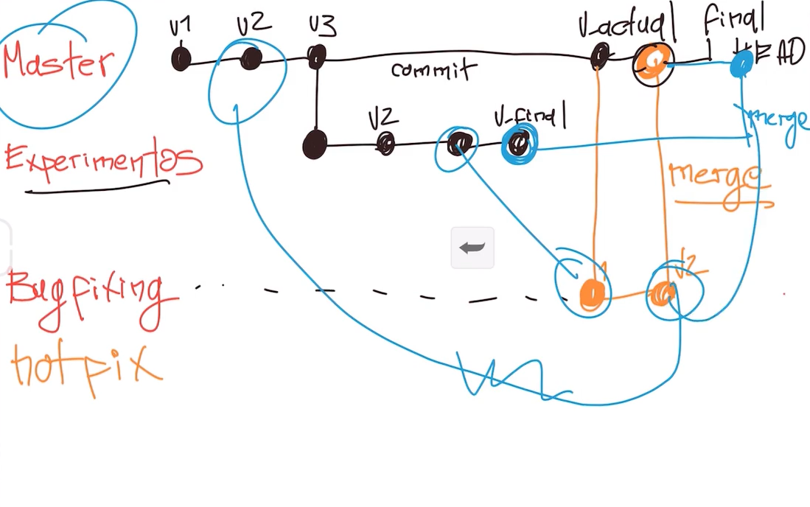

# What is a Branch?

In Git, a branch is a lightweight movable pointer to one of the commits. It represents an independent line of development.

---

## Key Concepts:

---

### [⬅️ Back to Git and GitHub Mastery Index](https://github.com/HumbertoMachado7/git-github-mastery)